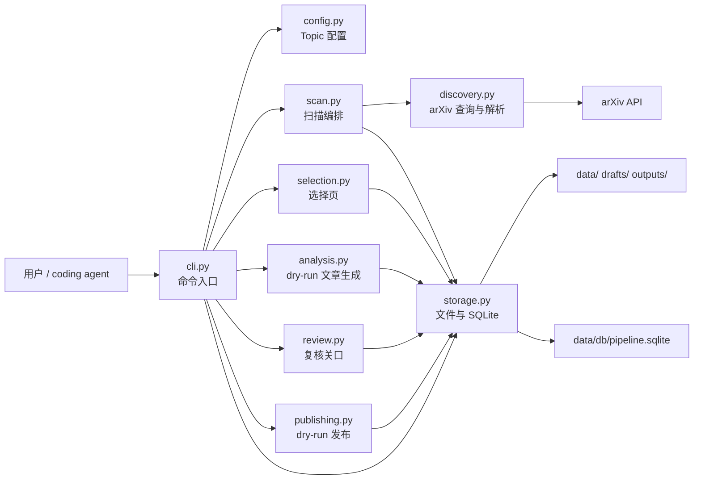
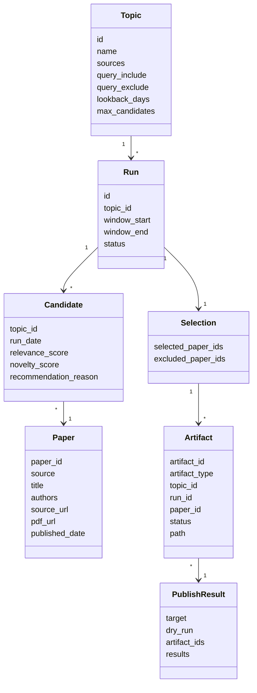
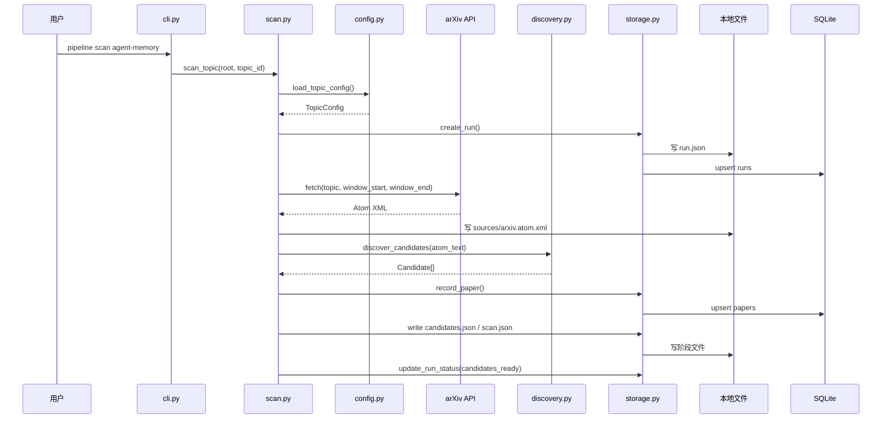
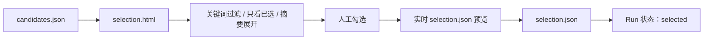
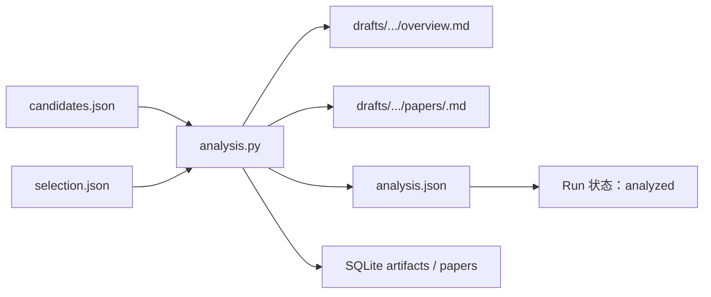
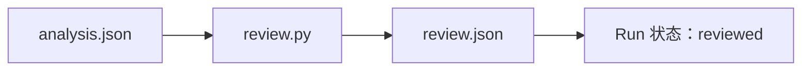
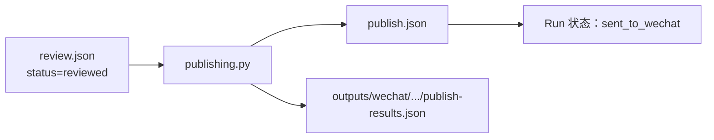
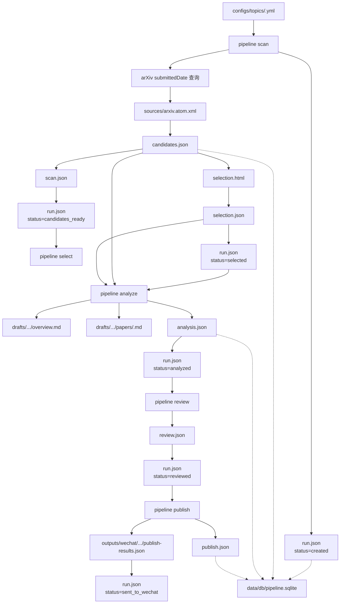
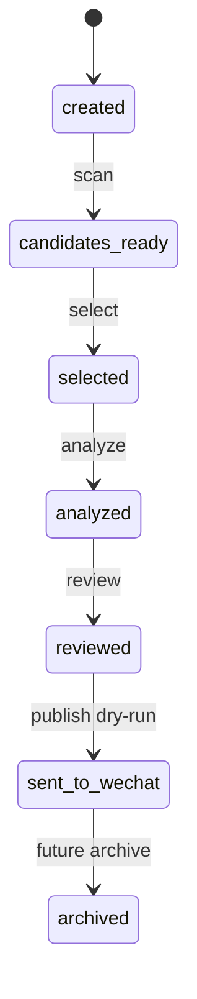

# IPMatrix 技术方案：模块关系与数据流

日期：2026-07-31

## 目标

本文说明 IPMatrix 当前 local-first MVP 的技术结构、模块边界、运行时数据流和后续扩展位置。项目当前核心链路是：

```text
scan -> select -> analyze -> review -> publish
```

第一版从 `agent-memory` 主题开始，使用 arXiv API 真实获取候选论文；生成、复核和发布仍保持 dry-run，以便先验证数据流、文件结构和状态机。

## 总体架构

IPMatrix 采用本地优先架构。CLI 负责触发阶段，pipeline 模块负责业务编排，JSON 文件负责透明记录，SQLite 负责索引和审计线索。



## 模块职责

### `cli.py`

命令行入口，负责解析参数和把命令转交给对应阶段模块。CLI 不应继续承载复杂业务逻辑；新增阶段能力时，应优先新增或扩展业务模块，再由 CLI 调用。

当前命令：

- `scan`
- `select`
- `analyze`
- `review`
- `publish`
- `status`

### `config.py`

负责读取 `configs/topics/<topic_id>.yml`，并转换为 `TopicConfig`。当前使用轻量 YAML 子集解析器，避免 MVP 阶段引入额外依赖。

关键输出：

- `topic.id`
- `topic.sources`
- `topic.query_include`
- `topic.query_exclude`
- `topic.lookback_days`
- `topic.max_candidates`

### `scan.py`

负责指定 Topic 的扫描编排，是当前真实论文获取的主入口。

主要步骤：

1. 加载 Topic 配置。
2. 创建 Run。
3. 根据 `lookback_days` 推导扫描窗口。
4. 调用 arXiv 客户端获取 Atom XML。
5. 保存来源快照 `sources/arxiv.atom.xml`。
6. 解析并过滤 Candidate。
7. 写入 `scan.json` 和 `candidates.json`。
8. 将 Run 状态推进到 `candidates_ready`。

后续接入 alphaXiv 或其他来源时，应从 `scan.py` 增加来源编排，不要把多来源逻辑塞进 `ArxivClient`。

### `discovery.py`

负责 arXiv 查询和 Atom 解析。

当前能力：

- 构造 arXiv API URL。
- 将 Topic 关键词转换为 `search_query`。
- 使用 `submittedDate:[YYYYMMDD0000 TO YYYYMMDD2359]` 限定扫描窗口。
- 解析 Atom entry 为 Paper / Candidate 基础数据。
- 将 arXiv ID 规范化为 `arxiv-2507-12345` 形式。
- 过滤窗口外论文。

### `selection.py`

负责生成本地 HTML 选择页。该页面不依赖后端服务，适合 local-first 工作流。

输入：

- `candidates.json`

页面能力：

- 以卡片展示论文标题、作者、发布日期、分类、推荐理由、摘要、arXiv 链接和 PDF 链接。
- 支持关键词过滤、只看已选、全选和清空。
- 勾选状态实时更新右侧 `selection.json` 预览。
- 摘要默认折叠，便于快速扫读。

输出：

- `selection.html`
- 人工下载或 CLI 默认生成的 `selection.json`

### `analysis.py`

负责 dry-run Markdown Artifact 生成。当前不调用真实 LLM 或 skill，只根据候选论文元数据生成可追踪的占位文章。

输入：

- `candidates.json`
- `selection.json`

输出：

- `drafts/<topic>/<run_id>/overview.md`
- `drafts/<topic>/<run_id>/papers/<paper_id>.md`
- `analysis.json`

后续接入真实生成能力时，该模块应保留 dry-run 模式，并记录 prompt、skill、model 和来源信息。

### `review.py`

负责复核关口。当前 MVP 将已生成 Artifact 标记为 `reviewed`，用于验证发布前门禁。

输入：

- `analysis.json`

输出：

- `review.json`

约束：

- 只有通过 review 的 Artifact 才能进入 publish。
- 后续应支持 `needs_revision` 等状态。

### `publishing.py`

负责发布阶段。当前只生成 dry-run 微信发布结果，不会真实调用公众号接口。

输入：

- `review.json`

输出：

- `publish.json`
- `outputs/wechat/<topic>/<run_id>/publish-results.json`

约束：

- 只接受 `reviewed` Artifact。
- 后续接真实 WeChat publisher 时，默认仍应支持 dry-run。

### `storage.py`

负责本地状态存储。它同时维护透明 JSON 文件和 SQLite 索引。

职责：

- 创建 Run 目录。
- 写入和读取阶段 JSON。
- 推进 Run 状态。
- 初始化 SQLite schema。
- 记录 Paper 和 Artifact 索引。

## 核心领域对象



## 运行时数据流

### 1. `scan`



`scan` 完成后，Run 目录包含：

```text
data/runs/<topic>/<run_id>/
  run.json
  scan.json
  candidates.json
  sources/
    arxiv.atom.xml
```

### 2. `select`



当前 CLI 在没有人工保存 `selection.json` 时，会默认全选候选论文，保证 MVP 闭环可跑。

### 3. `analyze`



当前生成内容为 dry-run Markdown。它验证 Artifact 路径、frontmatter、状态推进和后续发布门禁。

### 4. `review`



后续真实复核页面应在这里接入，不应绕过 `reviewed` 状态。

### 5. `publish`



当前为 dry-run，不会发送到微信公众号。

## 完整数据流转图



## 文件与 SQLite 的分工

### 文件是主工作记录

本地文件用于人工检查、复现和跨工具协作：

- `run.json`：Run 元信息和当前状态。
- `scan.json`：来源、查询 URL、来源快照位置和候选数量。
- `candidates.json`：候选论文列表。
- `selection.json`：人工选择结果。
- `analysis.json`：生成 Artifact 列表。
- `review.json`：复核结果。
- `publish.json`：发布阶段结果。

### SQLite 是索引与审计辅助

SQLite 当前保存：

- `runs`
- `papers`
- `artifacts`

SQLite 不应成为唯一事实来源。后续可以扩展 `candidates`、`selections`、`reviews`、`publish_jobs` 和 `publish_results` 表，但仍要保留对应 JSON 文件。

## 状态机



当前不支持任意回退。若需要重跑某阶段，优先创建新的 Run，或显式设计 `retry` 语义，避免覆盖已有审计记录。

## 扩展点

### 接入 alphaXiv

alphaXiv 应作为新的来源客户端接入：

```text
scan.py
  -> ArxivClient
  -> AlphaXivClient
  -> future SourceClient interface
```

接入原则：

- 不影响 arXiv 默认路径。
- 默认测试仍使用离线 fixture。
- 如需 API key 或 MCP 配置，不写入仓库。
- 来源快照仍保存到 `sources/`。
- Candidate schema 与 arXiv 输出保持一致。

### 接入真实生成能力

真实生成应替换或扩展 `analysis.py`，但保留 dry-run 开关。

新增字段至少包括：

- `generated_by_skill`
- `prompt_version`
- `model_name`
- `generated_at`
- `source_url`
- `pdf_url`

### 接入真实微信公众号发布

真实发布应扩展 `publishing.py`，但默认保持 dry-run。

必要约束：

- 只发布 `reviewed` Artifact。
- 不在测试中调用真实接口。
- 保存 `media_id`、`draft_url` 和错误信息。
- 不提交 token、cookie、AppSecret。

## 端到端验证

完整测试：

```bash
PYTHONPATH=src python3 -m unittest discover -s tests
```

离线 smoke test：

```bash
PYTHONPATH=src python3 -m ipmatrix.pipeline.cli scan agent-memory --from-file tests/fixtures/arxiv_atom_sample.xml --today 2026-07-31
PYTHONPATH=src python3 -m ipmatrix.pipeline.cli select agent-memory 2026-07-31_7d
PYTHONPATH=src python3 -m ipmatrix.pipeline.cli analyze agent-memory 2026-07-31_7d
PYTHONPATH=src python3 -m ipmatrix.pipeline.cli review agent-memory 2026-07-31_7d
PYTHONPATH=src python3 -m ipmatrix.pipeline.cli publish agent-memory 2026-07-31_7d
PYTHONPATH=src python3 -m ipmatrix.pipeline.cli status agent-memory 2026-07-31_7d
```

真实 arXiv smoke test：

```bash
PYTHONPATH=src python3 -m ipmatrix.pipeline.cli scan agent-memory
```

真实网络结果会随日期和 arXiv 数据变化。默认测试不依赖实时网络。
